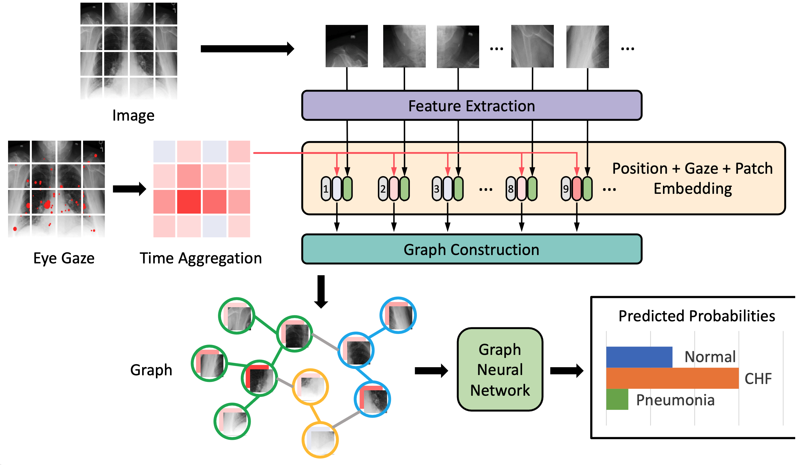
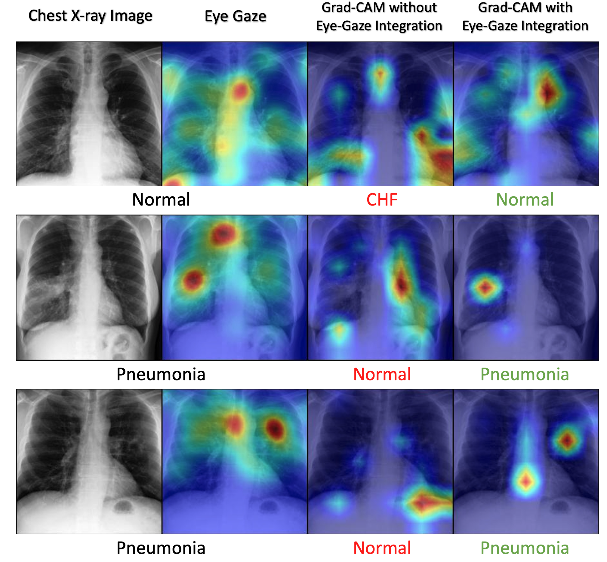

# GazeGNN: A Gaze-Guided Graph Neural Network for 3D Object Detection

Bin Wang, Hongyi Pan, Armstrong Aboah, Zheyuan Zhang, Ahmet Cetin, Drew Torigian, Baris Turkbey, Elizabeth Krupinski, Jayaram Udupa, Ulas Bagci

[[`Paper`](https://arxiv.org/abs/2305.18221)] [[`BibTeX`](#citing)]



Eye tracking research is important in computer vision because it can help us understand how humans interact with the visual world. 
Specifically for high-risk applications, such as in medical imaging, eye tracking can help us to comprehend how radiologists and other medical professionals search, analyze, and interpret images for diagnostic and clinical purposes. 
Hence, the application of eye tracking techniques in disease classification has become increasingly popular in recent years. 
Contemporary works usually transform gaze information collected by eye tracking devices into visual attention maps (VAMs) to supervise the learning process. 
However, this is a time-consuming preprocessing step, which stops us from applying eye tracking to radiologists' daily work.
To solve this problem, we propose a novel gaze-guided graph neural network (GNN), GazeGNN, to leverage raw eye-gaze data without being converted into VAMs.
In GazeGNN, to directly integrate eye gaze into image classification, we create a unified representation graph that models both images and gaze pattern information.
With this benefit, we develop a real-time, real-world, end-to-end disease classification algorithm for the first time in the literature.
This achievement demonstrates the practicality and feasibility of integrating real-time eye tracking techniques into the daily work of radiologists.
To our best knowledge, GazeGNN is the first work that adopts GNN to integrate image and eye-gaze data. Our experiments on the public chest X-ray dataset show that our proposed method exhibits the best classification performance compared to existing methods.


## Installation
This code adopts `pytorch>=1.7` and `torchvision>=0.8`. Please install dependencies by
```
pip install numpy matplotlib scitkit-learn tqdm pandas timm
```

Besides, you need to download the pretrained model checkpoint provided by Visual GNN as follows

- `Pyramid ViG-Ti`: [Github Release](https://github.com/huawei-noah/Efficient-AI-Backbones/releases/download/pyramid-vig/pvig_ti_78.5.pth.tar)

And put the checkpoint under "./pretrain/".

When you have done the above steps, you can train by
```
python train.py
```

## Dataset
In this study, we use the dataset from a public [Chest X-ray dataset](https://physionet.org/content/egd-cxr/1.0.0/) with gaze data, which contains 1083 cases from the MIMIC-CXR dataset. For each case, a gray-scaled X-ray image with the size of around $3000\times3000$, eye-gaze data, and ground-truth classification labels are provided. These cases are classified into 3 categories: Normal, Congestive Heart Failure (CHF), and Pneumonia.

We have already processed the raw DICOM data and generate a JPG dataset called [MIMIC-GAZE-JPG](https://physionet.org/content/egd-cxr/1.0.0/). In this processed dataset. we divide the original dataset into train and test datasets following the official split. It also contains the fixation heatmaps generated from raw gaze data. This processed dataset is for further fair comparison and reproducibility. Please download from the link https://physionet.org/content/egd-cxr/1.0.0/.

## Results

### Classification performance comparison
|             | Accuracy   |AUC     | Precision    | Recall       | F1           |
| ----------- | -----------  |-----------  |-----------   |-----------  |-----------   |
| GazeGNN     | 83.18%       | 0.923         | 0.839         | 0.821         | 0.823         |

### Infrerence time comparison

| Methods                   | Gaze Usage       | Inference Time |
| -----------               | ----------- | -----------         |
| GazeGNN                   | &check;       | **0.353s**           |
| Two-stream Architecture   | &check;        | 9.246s            |
| Attention Consistency Architecture  | &cross;        | 0.294s            |


## Visualization
Gaze map and Grad-CAM based attention maps with and without eye-gaze data are shown. Under the images, the original label of the chest X-ray is represented by the black color, while the red and green labels indicate incorrect and correct model predictions, respectively.




## Citing

```
@article{wang2023gazegnn,
  title={GazeGNN: A Gaze-Guided Graph Neural Network for Disease Classification},
  author={Wang, Bin and Pan, Hongyi and Aboah, Armstrong and Zhang, Zheyuan and Cetin, Ahmet and Torigian, Drew and Turkbey, Baris and Krupinski, Elizabeth and Udupa, Jayaram and Bagci, Ulas},
  journal={arXiv preprint arXiv:2305.18221},
  year={2023}
}
```